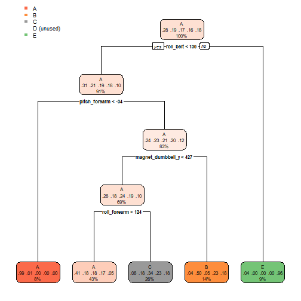

## Background

Using devices such as Jawbone Up, Nike FuelBand, and Fitbit it is now possible to collect a large amount of data about personal activity relatively inexpensively. These type of devices are part of the quantified self movement – a group of enthusiasts who take measurements about themselves regularly to improve their health, to find patterns in their behavior, or because they are tech geeks. One thing that people regularly do is quantify how much of a particular activity they do, but they rarely quantify how well they do it. In this project, your goal will be to use data from accelerometers on the belt, forearm, arm, and dumbell of 6 participants. They were asked to perform barbell lifts correctly and incorrectly in 5 different ways. More information is available from the website here: http://web.archive.org/web/20161224072740/http:/groupware.les.inf.puc-rio.br/har (see the section on the Weight Lifting Exercise Dataset).

## Data

The training data for this project are available here:
https://d396qusza40orc.cloudfront.net/predmachlearn/pml-training.csv

The test data are available here:
https://d396qusza40orc.cloudfront.net/predmachlearn/pml-testing.csv


## Summary

The goal of our project is to predict the manner in which they did the exercise.


## Libraries

```r
library(lattice)
library(caret)
```

```
## Loading required package: ggplot2
```

```r
library(randomForest)
```

```
## randomForest 4.6-14
```

```
## Type rfNews() to see new features/changes/bug fixes.
```

```
## 
## Attaching package: 'randomForest'
```

```
## The following object is masked from 'package:ggplot2':
## 
##     margin
```

```r
library(rpart)
library(rpart.plot)
library(RColorBrewer)
library(rattle)
```

```
## Loading required package: tibble
```

```
## Loading required package: bitops
```

```
## Rattle: A free graphical interface for data science with R.
## Version 5.4.0 Copyright (c) 2006-2020 Togaware Pty Ltd.
## Type 'rattle()' to shake, rattle, and roll your data.
```

```
## 
## Attaching package: 'rattle'
```

```
## The following object is masked from 'package:randomForest':
## 
##     importance
```

## Getting and cleaning the data

```r
train <- read.csv("C:/Users/dongj/Desktop/R_data_Desk/Practical_machine_learning/pml-training.csv", na.strings=c("NA","#DIV/0!",""))

test <- read.csv("C:/Users/dongj/Desktop/R_data_Desk/Practical_machine_learning/pml-testing.csv", na.strings=c("NA","#DIV/0!",""))

dim(train)
```

```
## [1] 19622   160
```

```r
dim(test)
```

```
## [1]  20 160
```

Remove missing values

In the summary, We can find there are missing values in our dataset.

```r
train <- train[,colSums(is.na(train))==0]
test <- test[,colSums(is.na(test))==0]
```

Remove unrelated data columns

columns 1 through columns 7 are the data that are not related to this model
(user_name, raw_timestamp_part_1, raw_timestamp_part_,2 cvtd_timestamp, new_window, and  num_window )

```r
train <- train[,-c(1:7)]
test <- test[,-c(1:7)]
```

## Cross Validation
Using the training data set, we split the data set into training and test sets

```r
inTrain <- createDataPartition(train$classe, p=0.75, list = FALSE)
training <- train[inTrain,]
testing <- train[-inTrain,]
```

## Decision Tree

```r
train_fit <- train(classe ~ .,method = "rpart", data = training)
print(train_fit$finalModel)
```

```
## n= 14718 
## 
## node), split, n, loss, yval, (yprob)
##       * denotes terminal node
## 
##  1) root 14718 10533 A (0.28 0.19 0.17 0.16 0.18)  
##    2) roll_belt< 129.5 13356  9227 A (0.31 0.21 0.19 0.18 0.1)  
##      4) pitch_forearm< -33.95 1196     6 A (0.99 0.005 0 0 0) *
##      5) pitch_forearm>=-33.95 12160  9221 A (0.24 0.23 0.21 0.2 0.12)  
##       10) magnet_dumbbell_y< 426.5 10162  7307 A (0.28 0.18 0.24 0.19 0.1)  
##         20) roll_forearm< 123.5 6273  3723 A (0.41 0.18 0.18 0.17 0.054) *
##         21) roll_forearm>=123.5 3889  2578 C (0.078 0.18 0.34 0.23 0.18) *
##       11) magnet_dumbbell_y>=426.5 1998  1002 B (0.042 0.5 0.048 0.23 0.18) *
##    3) roll_belt>=129.5 1362    56 E (0.041 0 0 0 0.96) *
```

```r
predict_fit <- predict(train_fit, testing)
confusionMatrix(table(predict_fit, testing$classe))
```

```
## Confusion Matrix and Statistics
## 
##            
## predict_fit    A    B    C    D    E
##           A 1247  375  409  352  145
##           B   39  352   33  158  129
##           C   91  222  413  294  234
##           D    0    0    0    0    0
##           E   18    0    0    0  393
## 
## Overall Statistics
##                                           
##                Accuracy : 0.4904          
##                  95% CI : (0.4763, 0.5045)
##     No Information Rate : 0.2845          
##     P-Value [Acc > NIR] : < 2.2e-16       
##                                           
##                   Kappa : 0.3342          
##                                           
##  Mcnemar's Test P-Value : NA              
## 
## Statistics by Class:
## 
##                      Class: A Class: B Class: C Class: D Class: E
## Sensitivity            0.8939  0.37092  0.48304   0.0000  0.43618
## Specificity            0.6349  0.90923  0.79229   1.0000  0.99550
## Pos Pred Value         0.4933  0.49508  0.32935      NaN  0.95620
## Neg Pred Value         0.9377  0.85762  0.87890   0.8361  0.88694
## Prevalence             0.2845  0.19352  0.17435   0.1639  0.18373
## Detection Rate         0.2543  0.07178  0.08422   0.0000  0.08014
## Detection Prevalence   0.5155  0.14498  0.25571   0.0000  0.08381
## Balanced Accuracy      0.7644  0.64007  0.63767   0.5000  0.71584
```

```r
rpart.plot(train_fit$finalModel)
```




## Random Forest Model

```r
train_rf <- train(classe ~ .,method = "rf", data = training, ntree= 50)
print(train_rf)
```

```
## Random Forest 
## 
## 14718 samples
##    52 predictor
##     5 classes: 'A', 'B', 'C', 'D', 'E' 
## 
## No pre-processing
## Resampling: Bootstrapped (25 reps) 
## Summary of sample sizes: 14718, 14718, 14718, 14718, 14718, 14718, ... 
## Resampling results across tuning parameters:
## 
##   mtry  Accuracy   Kappa    
##    2    0.9865345  0.9829614
##   27    0.9883960  0.9853182
##   52    0.9794482  0.9739950
## 
## Accuracy was used to select the optimal model using the largest value.
## The final value used for the model was mtry = 27.
```

```r
predict_rf <- predict(train_rf, testing)
confusionMatrix(table(predict_rf, testing$classe))
```

```
## Confusion Matrix and Statistics
## 
##           
## predict_rf    A    B    C    D    E
##          A 1395    8    0    0    0
##          B    0  940    1    2    1
##          C    0    1  852   11    1
##          D    0    0    2  791    1
##          E    0    0    0    0  898
## 
## Overall Statistics
##                                           
##                Accuracy : 0.9943          
##                  95% CI : (0.9918, 0.9962)
##     No Information Rate : 0.2845          
##     P-Value [Acc > NIR] : < 2.2e-16       
##                                           
##                   Kappa : 0.9928          
##                                           
##  Mcnemar's Test P-Value : NA              
## 
## Statistics by Class:
## 
##                      Class: A Class: B Class: C Class: D Class: E
## Sensitivity            1.0000   0.9905   0.9965   0.9838   0.9967
## Specificity            0.9977   0.9990   0.9968   0.9993   1.0000
## Pos Pred Value         0.9943   0.9958   0.9850   0.9962   1.0000
## Neg Pred Value         1.0000   0.9977   0.9993   0.9968   0.9993
## Prevalence             0.2845   0.1935   0.1743   0.1639   0.1837
## Detection Rate         0.2845   0.1917   0.1737   0.1613   0.1831
## Detection Prevalence   0.2861   0.1925   0.1764   0.1619   0.1831
## Balanced Accuracy      0.9989   0.9948   0.9966   0.9915   0.9983
```

Accuracy for Decision tree gives 49.84% compared to the Random forest model which is 99.23% accuracy.
The formula for expected out-of-sample error is 1 - accuracy for prediction.
The expected out-of-sample error for the decision tree is 50.14%, but the Random forest model gives only 0.77%. 

Since the Random forest model prediction gives higher accuracy than decision tree prediction, we choose a random forest model prediction. 

## Random Forest Prediction Model

```r
predict(train_rf, test)
```

```
##  [1] B A B A A E D B A A B C B A E E A B B B
## Levels: A B C D E
```

